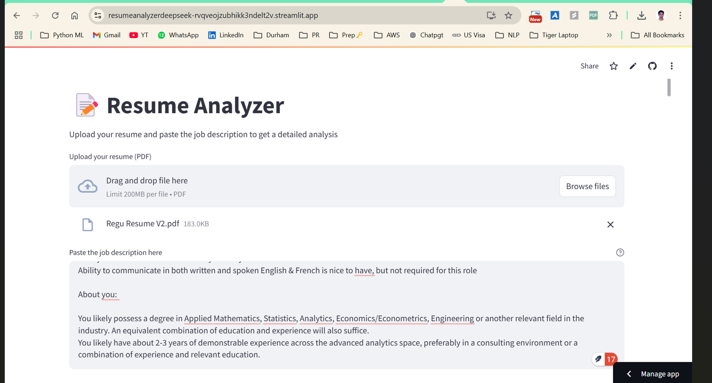
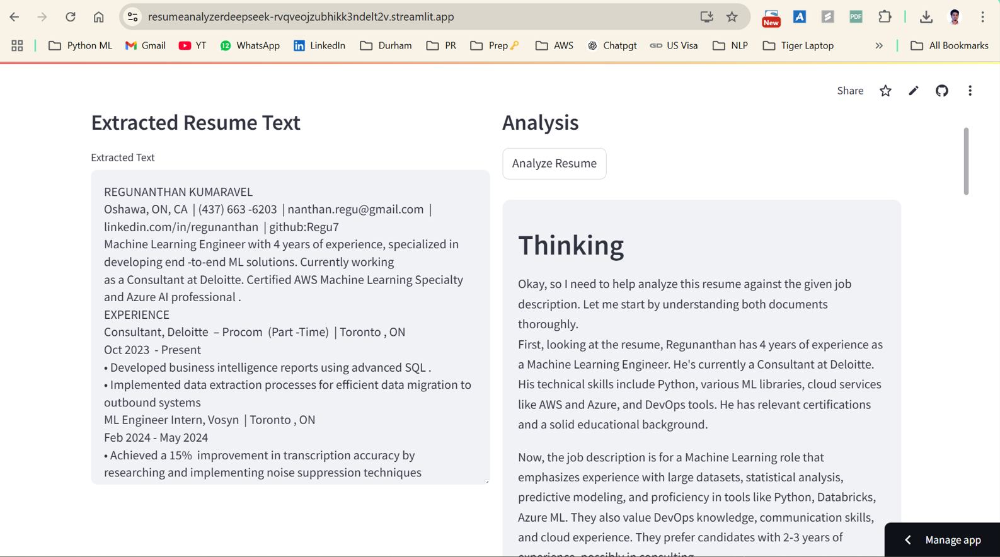
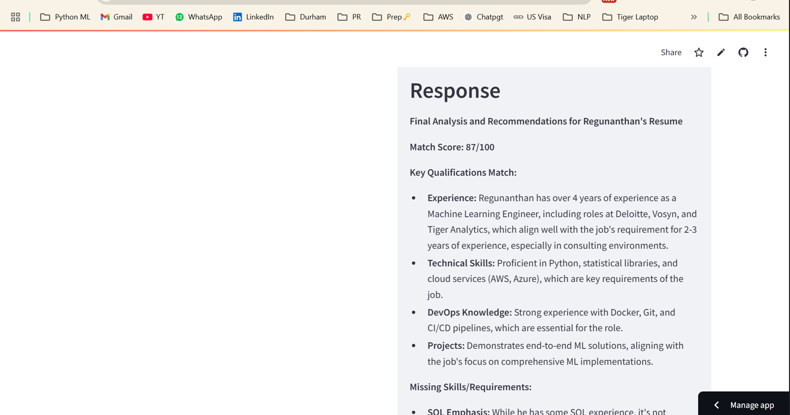
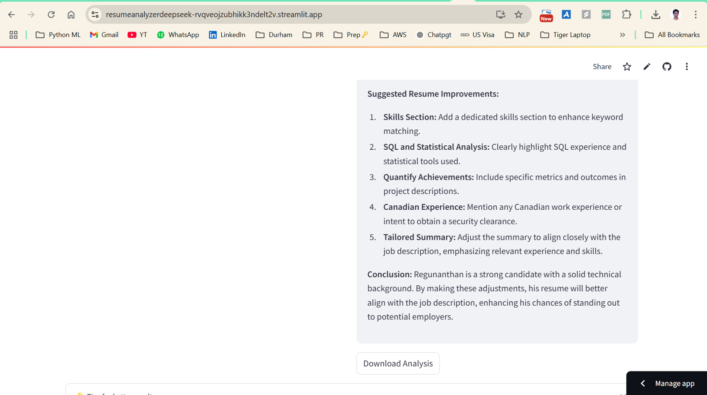

# Resume Analyzer

A Streamlit-based application that analyzes resumes using GROQ LLM API (deepseek-r1-distill-qwen-32b) and stores resumes in AWS DynamoDB. The analyzer provides comprehensive insights including match scores, qualification analysis, and improvement suggestions.

## Features

- Resume matching score (0-100)
- Key qualifications analysis
- Identification of missing skills and requirements
- Candidate strengths assessment
- Areas for improvement highlights
- Actionable resume enhancement suggestions
- Automatic storage of analysis results in AWS DynamoDB

## Demo Screenshots

*Resume upload interface with job description input*



*Extract text from Resume*



*Detailed analysis showing match score and qualifications*



*Suggestions to improve the resume*


## Prerequisites

- Python 3.8+
- AWS Account with DynamoDB access. You need a table name called 'resume-analyzer'
- GROQ API key
- Conda or Python virtual environment

## Installation

1. Clone the repository:
```bash
git clone https://github.com/yourusername/resume-analyzer.git
cd resume-analyzer
```

2. Create and activate a virtual environment:

Using Conda:
```bash
conda create -n resume-analyzer python=3.8
conda activate resume-analyzer
```

OR using venv:
```bash
python -m venv venv
# On Windows
.\venv\Scripts\activate
# On Unix or MacOS
source venv/bin/activate
```

3. Install required packages:
```bash
pip install -r requirements.txt
```

4. Create a `.env` file in the project root directory with your credentials:
```plaintext
AWS_ACCESS_KEY_ID=your_aws_access_key
AWS_SECRET_ACCESS_KEY=your_aws_secret_key
AWS_REGION=your_aws_region
GROQ_API_KEY=your_groq_api_key
```

## Usage

1. Start the Streamlit application:
```bash
streamlit run main.py
```

2. Open your web browser and navigate to the provided local URL (typically http://localhost:8501)

3. Upload a resume file and wait for the analysis results

## Project Structure

```
Resume_Analyzer_DeepSeek/
├── main.py
├── requirements.txt
├── .env
├── README.md

```

## Dependencies

Key dependencies include:
- streamlit
- boto3
- groq

Full list of dependencies can be found in `requirements.txt`

## Environment Variables

Required environment variables in `.env` file:
- `AWS_ACCESS_KEY_ID`: Your AWS access key
- `AWS_SECRET_ACCESS_KEY`: Your AWS secret access key
- `AWS_REGION`: AWS region for DynamoDB
- `GROQ_API_KEY`: Your GROQ API key

# Screenshots


